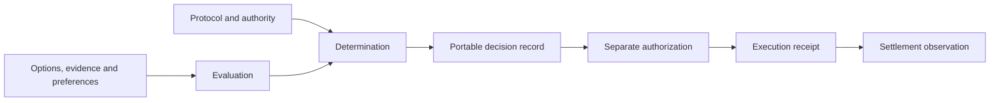

# Open Decisions

**A community standard for decisions that can be understood, exchanged, and checked.**

When an application recommends an option or determines that a condition has been
met, the answer alone is not enough. People need to know what was considered,
which evidence was used, whose preferences mattered, which rules were applied,
and who is accountable.

Open Decisions defines a portable record of that process. It lets different
applications, evaluators, and decision services exchange the same decision
without requiring the same model, cloud, identity system, or payment network.

**Status: 0.3.0-draft.1 — community proposal.** The original core remains at
0.1.0-draft.1; comparison, Decision Evals and the optional UDID v2 record profile
have their own versions. This repository contains a working specification, schemas, examples,
and a reference conformance checker.
It does not claim community adoption, independent implementation, certification,
or production readiness. Feedback and alternative implementations are welcome.



A model can assess evidence. A decision method applies the declared policy.
An authorized person or system separately permits an action. Execution and
settlement each require their own records. None of these steps proves the next.

## Start here

| If you want to… | Read |
| --- | --- |
| Understand the standard | [Core specification](spec/0.1.0-draft.1/core.md) |
| Inspect the wire format | [JSON Schema](schemas/0.1.0-draft.1/bundle.schema.json) |
| Determine whether conditions are met | [Threshold eligibility profile](spec/0.1.0-draft.1/profiles/threshold-gates.md) |
| Compare options under uncertainty | [Scenario ranking profile](spec/0.1.0-draft.1/profiles/weighted-scenarios.md) |
| Build comparison kits and typed assessment manifests | [Comparison profile](spec/comparison/0.1.0-draft.1/core.md) and [RFC 0003](rfcs/0003-comparison-kits.md) |
| Review the UDID v2 schemas and planned token tests | [Optional UDID profile](spec/udid/2.0.0-draft.1/core.md), [examples and vector plan](examples/udid/2.0.0-draft.1/README.md), and [RFC 0005](rfcs/0005-udid-v2-schema-and-vectors.md) |
| Check an implementation | [Conformance requirements](spec/0.1.0-draft.1/conformance.md) |
| Walk through a decision | [Examples guide](examples/README.md) |
| Integrate Jev, IXO, or a connector | [Integration boundaries](docs/integrations.md) |
| Propose a change | [Contributing](CONTRIBUTING.md) and [governance](GOVERNANCE.md) |

## Try it

Requires Node.js 22 or newer. The checker runs locally and makes no provider,
identity, evidence-retrieval, or payment calls.

```sh
npm ci --ignore-scripts
npm run check
npm run validate -- examples/valid/buy-after-clarification.json
npm run validate -- examples/valid/pay-simulation.json
```

A valid report separates `schema`, `semantics`, `replay`, and `integrity` checks.
It explicitly reports evidence, authority, signatures, execution, and settlement
verification as `not_performed`. An invalid bundle exits with code 1.

The payment example uses fictional evidence, an uncalibrated illustrative
threshold, and a simulated payment. The buying example uses fictional products
and supplied scenarios. Neither example invokes a model or spends money.

## What this draft establishes

- An immutable snapshot of protocol, request, and evaluation records, bound to a
  decision with SHA-256 digests over canonical JSON.
- Explicit criteria, hard constraints, preferences, evidence references,
  evaluator identity and method versions, uncertainty, and review routes.
- Two reproducible methods: threshold gates and weighted finite scenarios.
- Separate action intent, authorization, execution, and settlement records.
- Valid and invalid fixtures, an offline reference checker, and CI.
- An open proposal and review process, with transparent bootstrap stewardship.

The draft deliberately leaves model inference, credential verification,
capability enforcement, payment connectors, and signed proof formats to
integrations and future profiles. Hashes detect changes relative to a trusted
reference; a rehashed fabrication can still be internally consistent.

The optional UDID profile adds processed-record schemas and local consistency
checks. Its 13 signed-token conformance vectors are planned for M1; digest and
disclosure conflicts remain open for review. A passing record check does not
verify a UDID token or authorize a payment.

## Community and scope

Initiated in the IXO ecosystem and hosted by ImpactsAI, this proposal is open to
implementations with no IXO dependency. Jev and consumer connectors motivated
some use cases; they have no privileged role in the core format.

Initial use cases are comparing purchases and determining payment eligibility.
Clinical decision-making is a possible future domain profile, with separate
clinical validation and professional oversight; this draft supplies neither.

See the [design decisions](docs/design-decisions.md), [roadmap](ROADMAP.md), and
[source notes](docs/sources.md). All repository content remains under the
existing [MIT license](LICENSE).

## Decision Evals draft

[Decision Evals](spec/decision-evals/0.1.0-draft.1/core.md) defines benchmark suites, calibration artifacts, validation reports, `model-card.json`, immutable kit releases and calibration application records. Use `open-decisions/evals` for offline validation and the reference calibration functions. [RFC 0004](rfcs/0004-decision-evals.md), the [implementation plan](docs/decision-evals-implementation.md) and [fictional release](examples/decision-evals/README.md) explain its scope. This independently versioned community draft does not change existing core/comparison contracts or authorize consequential use.
